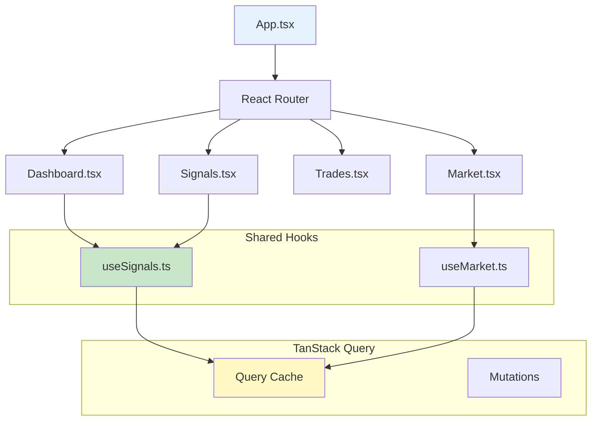
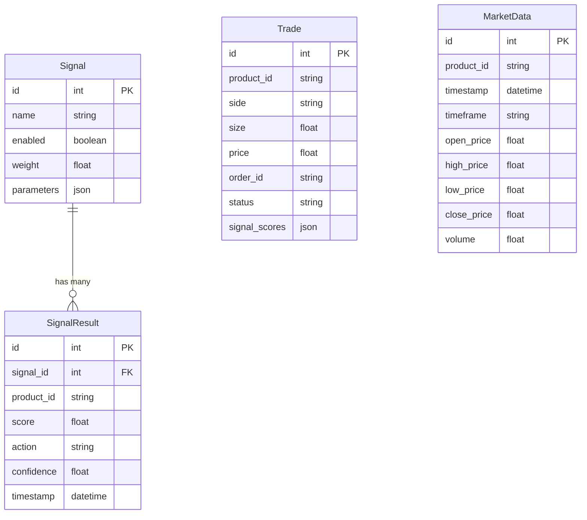
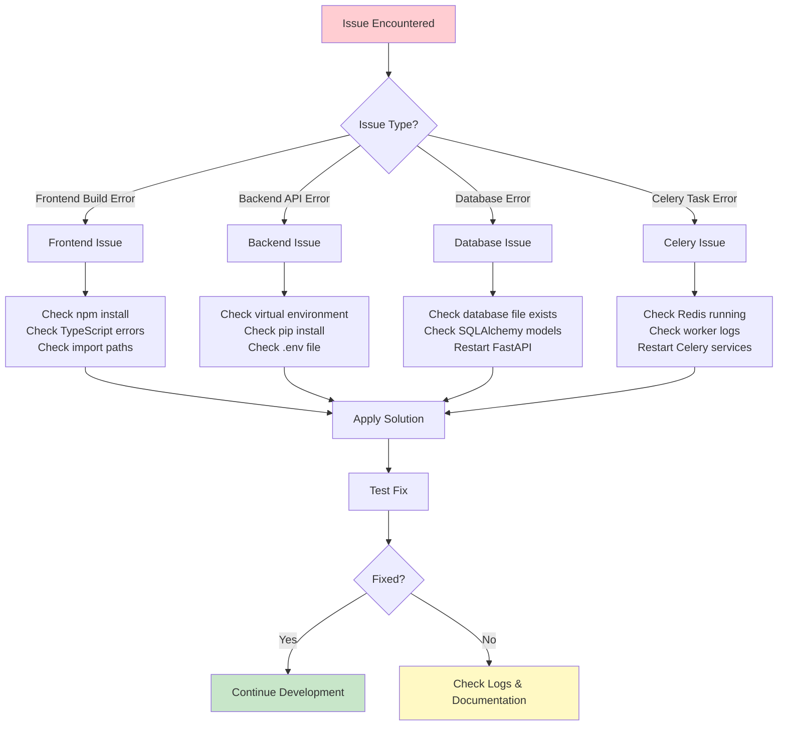
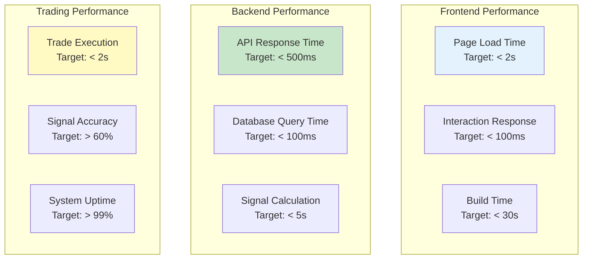

# Quick Reference Visual Guide

This document provides quick visual references for common development tasks and project navigation.

## Project Structure Overview

```
trader/
├── 📊 docs/                          # Visual documentation
│   ├── VISUAL_ARCHITECTURE.md        # Main architectural diagrams
│   ├── DEVELOPMENT_WORKFLOWS.md      # Development process diagrams
│   └── QUICK_REFERENCE.md            # This file
├── 🐍 backend/                       # Python FastAPI backend
│   ├── app/
│   │   ├── 🔌 api/                   # REST API endpoints
│   │   │   ├── bots.py               # Bot management API (PRIMARY)
│   │   │   ├── trades.py             # Trading operations API
│   │   │   ├── market.py             # Market data API
│   │   │   └── schemas.py            # Pydantic models
│   │   ├── ⚙️ core/                  # Core configuration
│   │   │   ├── config.py             # Settings & environment
│   │   │   └── database.py           # SQLAlchemy setup
│   │   ├── 📝 models/                # Database models
│   │   │   └── models.py             # SQLAlchemy models
│   │   ├── 🔧 services/              # Business logic
│   │   │   ├── coinbase_service.py   # Coinbase API client
│   │   │   ├── bot_evaluator.py      # Signal evaluation service
│   │   │   └── signals/              # Signal implementations
│   │   │       ├── base.py           # Abstract base signal
│   │   │       └── technical.py      # RSI, MA, MACD signals
│   │   ├── ⚡ tasks/                 # Background tasks
│   │   │   ├── celery_app.py         # Celery configuration
│   │   │   ├── data_tasks.py         # Data collection tasks
│   │   │   └── trading_tasks.py      # Signal evaluation tasks
│   │   └── main.py                   # FastAPI application
│   └── requirements.txt              # Python dependencies
├── ⚛️ frontend/                      # React TypeScript frontend
│   ├── src/
│   │   ├── 📱 pages/                 # Main page components
│   │   │   ├── Dashboard.tsx         # Main overview page
│   │   │   ├── Signals.tsx           # Bot management page (renamed from Signals)
│   │   │   ├── Trades.tsx            # Trade history page
│   │   │   └── Market.tsx            # Market data page
│   │   ├── 🪝 hooks/                 # Custom React hooks
│   │   │   ├── useBots.ts            # Bot API hooks (PRIMARY)
│   │   │   ├── useSignals.ts         # Legacy signal hooks (deprecated)
│   │   │   └── useMarket.ts          # Market data hooks
│   │   ├── 🎯 types/                 # TypeScript definitions
│   │   │   └── index.ts              # API response types
│   │   ├── App.tsx                   # Main application
│   │   └── main.tsx                  # React entry point
│   ├── package.json                  # Node dependencies
│   └── tailwind.config.js            # TailwindCSS config
├── 🐳 docker-compose.yml             # Redis service
├── 📋 .env.example                   # Environment template
└── 📖 README.md                      # Project documentation
```

## Quick Command Reference

### Development Startup Commands
```bash
# Backend Setup (Terminal 1)
cd /Users/lazy_genius/Projects/trader/backend
source venv/bin/activate
pip install -r requirements.txt
uvicorn app.main:app --reload

# Frontend Setup (Terminal 2)
cd /Users/lazy_genius/Projects/trader/frontend
npm install
npm run dev

# Background Services (Terminal 3)
cd /Users/lazy_genius/Projects/trader
docker-compose up redis

# Celery Worker (Terminal 4)
cd /Users/lazy_genius/Projects/trader/backend
source venv/bin/activate
celery -A app.tasks.celery_app worker --loglevel=info

# Celery Scheduler (Terminal 5)
cd /Users/lazy_genius/Projects/trader/backend
source venv/bin/activate
celery -A app.tasks.celery_app beat --loglevel=info
```

## Signal Development Quick Guide

### Adding a New Signal
```mermaid
flowchart LR
    CREATE[Create Signal Class] --> INHERIT[Inherit from BaseSignal]
    INHERIT --> IMPLEMENT[Implement calculate() method]
    IMPLEMENT --> REGISTER[Register in signal factory]
    REGISTER --> DATABASE[Add to database]
    DATABASE --> TEST[Test signal logic]
    TEST --> UI[Update frontend if needed]
    
    style CREATE fill:#e3f2fd
    style TEST fill:#c8e6c9
    style UI fill:#f3e5f5
```

### Signal Implementation Template
```python
# backend/app/services/signals/my_signal.py
from typing import Dict, Any
import pandas as pd
from .base import BaseSignal

class MySignal(BaseSignal):
    def __init__(self, param1: float = 10, param2: float = 0.5, **kwargs):
        super().__init__(
            name="MySignal",
            description="Description of what this signal does",
            param1=param1,
            param2=param2,
            **kwargs
        )
    
    def calculate(self, data: pd.DataFrame) -> Dict[str, Any]:
        if not self.is_valid_data(data):
            return {"score": 0, "action": "hold", "confidence": 0, "metadata": {}}
        
        # Your signal calculation logic here
        param1 = self.parameters["param1"]
        param2 = self.parameters["param2"]
        
        # Calculate your indicator
        # Example: moving_average = data['close'].rolling(param1).mean()
        
        # Generate score (-1 to 1)
        score = 0.0  # Your calculation
        
        # Determine action
        if score > param2:
            action = "buy"
        elif score < -param2:
            action = "sell"
        else:
            action = "hold"
        
        # Calculate confidence (0 to 1)
        confidence = abs(score)
        
        return {
            "score": score,
            "action": action, 
            "confidence": confidence,
            "metadata": {
                "param1_value": param1,
                "param2_value": param2,
                # Add any additional debug info
            }
        }
```

## API Quick Reference

### Key Endpoints
```mermaid
graph LR
    subgraph "Bot Management"
        GET_BOTS[GET /api/v1/bots<br/>List all bots]
        POST_BOT[POST /api/v1/bots<br/>Create new bot]
        PUT_BOT[PUT /api/v1/bots/{id}<br/>Update bot config]
        GET_STATUS[GET /api/v1/bots/status/summary<br/>Bot status overview]
    end
    
    subgraph "Signal Confirmation (Phase 2.3)"
        GET_CONFIRM[GET /api/v1/bots/{id}/confirmation-status<br/>Confirmation status]
        GET_HISTORY[GET /api/v1/bots/{id}/signal-history<br/>Signal history]
        POST_RESET[POST /api/v1/bots/{id}/reset-confirmation<br/>Reset confirmation]
    end
    
    subgraph "Trading Operations"
        GET_TRADES[GET /api/v1/trades<br/>Trade history]
        GET_STATS[GET /api/v1/trades/stats<br/>Trading statistics]
    end
    
    subgraph "Market Data"
        GET_TICKER[GET /api/v1/market/ticker/{pair}<br/>Current prices]
        GET_CANDLES[GET /api/v1/market/candles/{pair}<br/>Historical OHLCV]
        GET_ACCOUNTS[GET /api/v1/market/accounts<br/>Account balances]
    end
    
    style GET_BOTS fill:#e3f2fd
    style GET_CONFIRM fill:#c8e6c9
    style GET_TRADES fill:#fff3e0
    style GET_TICKER fill:#f3e5f5
```

### Request/Response Examples

#### Bot Creation (Phase 2.3)
```bash
# Create bot with signal confirmation
POST /api/v1/bots/
{
  "name": "BTC Scalper Pro",
  "description": "High-frequency BTC trading with confirmation",
  "pair": "BTC-USD",
  "position_size_usd": 500,
  "confirmation_minutes": 3,
  "trade_step_pct": 1.5,
  "cooldown_minutes": 20,
  "signal_config": {
    "rsi": {
      "enabled": true,
      "weight": 0.4,
      "period": 14,
      "buy_threshold": 30,
      "sell_threshold": 70
    },
    "moving_average": {
      "enabled": true,
      "weight": 0.6,
      "fast_period": 10,
      "slow_period": 20
    }
  }
}
```

#### Signal Confirmation Status (Phase 2.3)
```bash
# Check confirmation status
GET /api/v1/bots/1/confirmation-status
{
  "bot_id": 1,
  "bot_name": "BTC Scalper Pro",
  "confirmation_status": {
    "is_confirmed": false,
    "needs_confirmation": true,
    "status": "confirming",
    "action_being_confirmed": "buy",
    "confirmation_start": "2025-09-02T15:30:00Z",
    "confirmation_progress": 0.67,
    "time_remaining_minutes": 1.0
  }
}
```

#### Signal History (Phase 2.3)
```bash
# Get recent signal evaluations
GET /api/v1/bots/1/signal-history?limit=5
{
  "bot_id": 1,
  "bot_name": "BTC Scalper Pro",
  "signal_history": [
    {
      "timestamp": "2025-09-02T15:32:00Z",
      "combined_score": -0.65,
      "action": "buy",
      "confidence": 0.82,
      "signal_scores": {
        "rsi": {"score": -0.8, "confidence": 0.9},
        "moving_average": {"score": -0.5, "confidence": 0.75}
      },
      "price": 67250.50
    }
  ],
  "total_entries": 1
}
```

// Signal Results Response
GET /api/v1/signals/results
{
  "signals": [
    {
      "id": 1,
      "name": "RSI",
      "score": 0.8,
      "action": "buy",
      "confidence": 0.9,
      "timestamp": "2025-09-02T10:30:00Z"
    }
  ]
}

// Market Data Response
GET /api/v1/market/price?product_id=BTC-USD
{
  "product_id": "BTC-USD",
  "price": 65432.10,
  "timestamp": "2025-09-02T10:30:00Z",
  "volume_24h": 1234567.89
}
```

## Frontend Component Quick Reference

### Component Architecture


### Adding a New Page
```bash
# 1. Create page component
touch frontend/src/pages/MyPage.tsx

# 2. Add route in App.tsx
# Add to imports: import MyPage from './pages/MyPage';
# Add to routes: <Route path="/mypage" element={<MyPage />} />

# 3. Add navigation link
# Add to navigation section with appropriate icon

# 4. Create custom hook if needed
touch frontend/src/hooks/useMyData.ts
```

## Database Quick Reference

### Model Relationships


### Common Database Operations
```python
# Get all active bots
active_bots = db.query(Bot).filter(Bot.status == "RUNNING").all()

# Get bot with signal configuration
bot = db.query(Bot).filter(Bot.id == 1).first()
signal_config = json.loads(bot.signal_config)

# Get bot signal history for confirmation tracking
history = db.query(BotSignalHistory)\
    .filter(BotSignalHistory.bot_id == 1)\
    .order_by(BotSignalHistory.timestamp.desc())\
    .limit(10).all()

# Get recent trades by bot
recent_trades = db.query(Trade)\
    .filter(Trade.bot_id == 1)\
    .filter(Trade.status == "filled")\
    .order_by(Trade.filled_at.desc())\
    .limit(20).all()

# Get market data for signal calculation
market_data = db.query(MarketData)\
    .filter(MarketData.product_id == "BTC-USD")\
    .filter(MarketData.timeframe == "1h")\
    .order_by(MarketData.timestamp.desc())\
    .limit(100).all()
```

### Phase 2.3 Signal Confirmation Operations
```python
# Check bot confirmation status
from app.services.bot_evaluator import get_bot_evaluator

evaluator = get_bot_evaluator(db)
confirmation_status = evaluator.get_confirmation_status(bot)

# Get confirmation progress
progress = confirmation_status['confirmation_progress']  # 0.0 to 1.0
time_remaining = confirmation_status['time_remaining_minutes']

# Reset confirmation timer
bot.signal_confirmation_start = None
db.commit()

# Get signal history for analysis
history = evaluator.get_signal_history(bot, limit=50)
for entry in history:
    print(f"{entry['timestamp']}: {entry['action']} (score: {entry['combined_score']})")
```

## Troubleshooting Quick Guide

### Common Issues & Solutions


### Log Locations
```bash
# FastAPI logs (in terminal where uvicorn is running)
cd /Users/lazy_genius/Projects/trader/backend
source venv/bin/activate
uvicorn app.main:app --reload

# Celery worker logs
cd /Users/lazy_genius/Projects/trader/backend
source venv/bin/activate
celery -A app.tasks.celery_app worker --loglevel=info

# React development logs (in terminal where npm run dev is running)
cd /Users/lazy_genius/Projects/trader/frontend
npm run dev

# Browser console for frontend errors
# Open browser dev tools (F12) and check Console tab
```

## Performance Monitoring

### Key Metrics to Watch


This quick reference guide provides immediate access to the most common development tasks and navigation points for leading the trading bot project effectively.
