# Trading Bot Visual Architecture Guide

This document provides comprehensive visual perspectives of the signal-based trading bot project from multiple angles and depths.

## Table of Contents

1. [System Overview](#1-system-overview)
2. [Technical Architecture](#2-technical-architecture)
3. [Business Logic Flow](#3-business-logic-flow)
4. [User Experience Journey](#4-user-experience-journey)
5. [Bot Functionality Deep Dive](#5-bot-functionality-deep-dive)
6. [App Responsiveness Architecture](#6-app-responsiveness-architecture)
7. [Development Roadmap](#7-development-roadmap)

---

## 1. System Overview

### High-Level Architecture
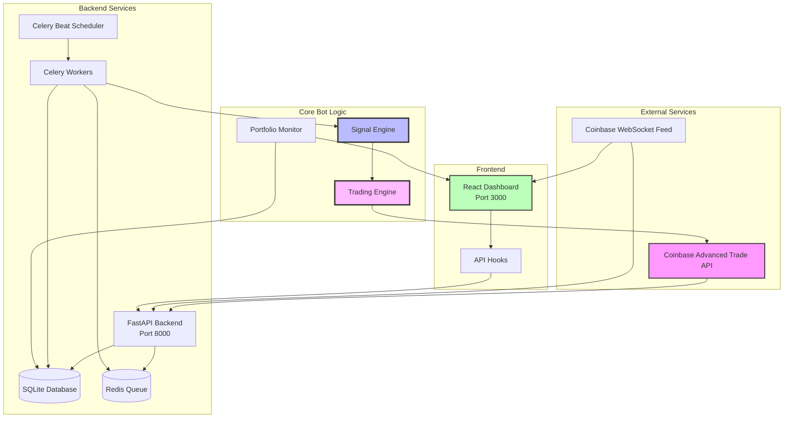
```mermaid
graph TB
    subgraph "External Services"
        CB[Coinbase Advanced Trade API]
        WS[Coinbase WebSocket Feed]
    end
    
    subgraph "Backend Services"
        API[FastAPI Backend<br/>Port 8000]
        DB[(SQLite Database)]
        REDIS[(Redis Queue)]
        CELERY[Celery Workers]
        BEAT[Celery Beat Scheduler]
    end
    
    subgraph "Frontend"
        REACT[React Dashboard<br/>Port 3000]
        HOOKS[API Hooks]
    end
    
    subgraph "Core Bot Logic"
        SIGNALS[Signal Engine]
        TRADER[Trading Engine]
        MONITOR[Portfolio Monitor]
    end
    
    %% External connections
    CB --> API
    WS --> API
    
    %% Backend internal
    API --> DB
    API --> REDIS
    CELERY --> REDIS
    BEAT --> CELERY
    CELERY --> DB
    CELERY --> SIGNALS
    SIGNALS --> TRADER
    TRADER --> CB
    
    %% Frontend connections
    REACT --> HOOKS
    HOOKS --> API
    WS --> REACT
    
    %% Monitoring
    MONITOR --> DB
    MONITOR --> REACT
    
    style CB fill:#f9f,stroke:#333,stroke-width:2px
    style SIGNALS fill:#bbf,stroke:#333,stroke-width:3px
    style TRADER fill:#fbf,stroke:#333,stroke-width:3px
    style REACT fill:#bfb,stroke:#333,stroke-width:2px
```

### Technology Stack Map
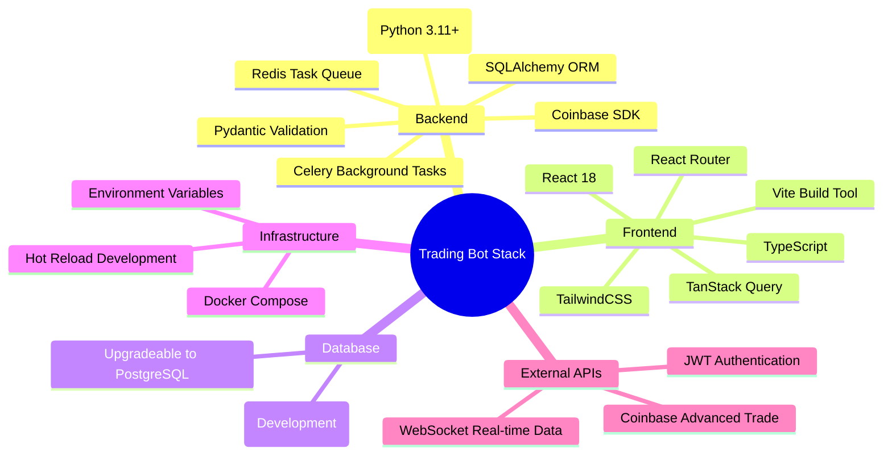
```mermaid
mindmap
  root((Trading Bot Stack))
    Backend
      FastAPI (Python 3.11+)
      SQLAlchemy ORM
      Pydantic Validation
      Celery Background Tasks
      Redis Task Queue
      Coinbase SDK
    Frontend
      React 18
      TypeScript
      TailwindCSS
      Vite Build Tool
      TanStack Query
      React Router
    Database
      SQLite (Development)
      Upgradeable to PostgreSQL
    Infrastructure
      Docker Compose
      Environment Variables
      Hot Reload Development
    External APIs
      Coinbase Advanced Trade
      WebSocket Real-time Data
      JWT Authentication
```

---

## 2. Technical Architecture

### Component Interaction Diagram
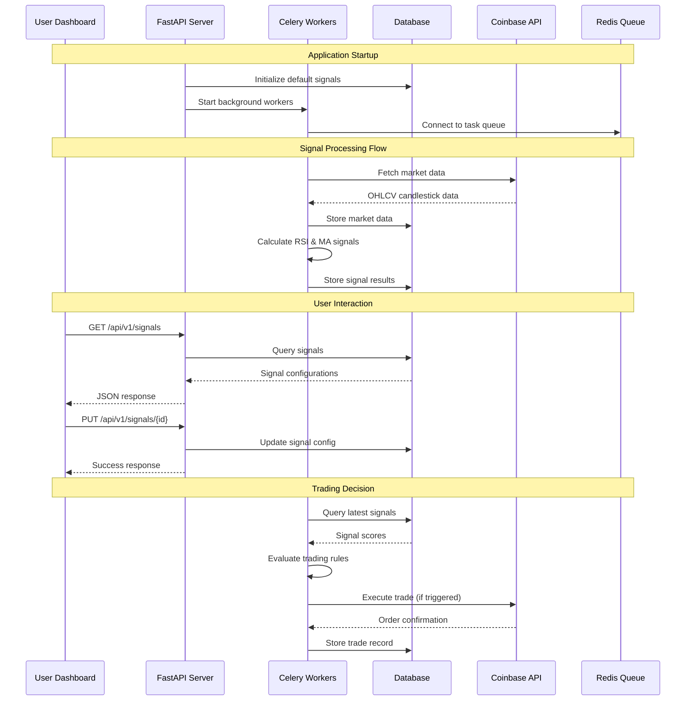
```mermaid
sequenceDiagram
    participant U as User Dashboard
    participant A as FastAPI Server
    participant C as Celery Workers
    participant D as Database
    participant CB as Coinbase API
    participant R as Redis Queue
    
    Note over U,R: Application Startup
    A->>D: Initialize default signals
    A->>C: Start background workers
    C->>R: Connect to task queue
    
    Note over U,R: Signal Processing Flow
    C->>CB: Fetch market data
    CB-->>C: OHLCV candlestick data
    C->>D: Store market data
    C->>C: Calculate RSI & MA signals
    C->>D: Store signal results
    
    Note over U,R: User Interaction
    U->>A: GET /api/v1/signals
    A->>D: Query signals
    D-->>A: Signal configurations
    A-->>U: JSON response
    
    U->>A: PUT /api/v1/signals/{id}
    A->>D: Update signal config
    A-->>U: Success response
    
    Note over U,R: Trading Decision
    C->>D: Query latest signals
    D-->>C: Signal scores
    C->>C: Evaluate trading rules
    C->>CB: Execute trade (if triggered)
    CB-->>C: Order confirmation
    C->>D: Store trade record
```

### Database Schema
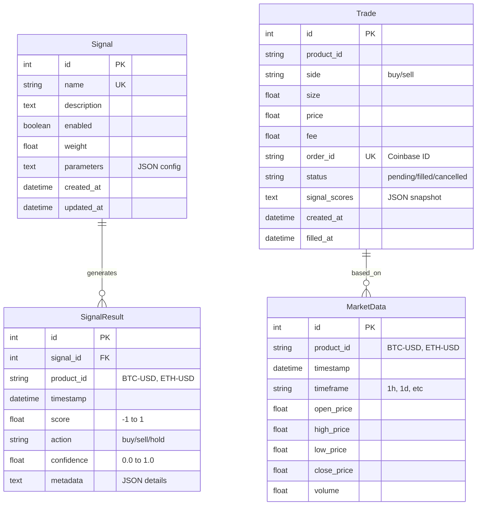
```mermaid
erDiagram
    Signal ||--o{ SignalResult : generates
    Trade ||--o{ MarketData : based_on
    
    Signal {
        int id PK
        string name UK
        text description
        boolean enabled
        float weight
        text parameters "JSON config"
        datetime created_at
        datetime updated_at
    }
    
    SignalResult {
        int id PK
        int signal_id FK
        string product_id "BTC-USD, ETH-USD"
        datetime timestamp
        float score "-1 to 1"
        string action "buy/sell/hold"
        float confidence "0.0 to 1.0"
        text metadata "JSON details"
    }
    
    MarketData {
        int id PK
        string product_id "BTC-USD, ETH-USD"
        datetime timestamp
        string timeframe "1h, 1d, etc"
        float open_price
        float high_price
        float low_price
        float close_price
        float volume
    }
    
    Trade {
        int id PK
        string product_id
        string side "buy/sell"
        float size
        float price
        float fee
        string order_id UK "Coinbase ID"
        string status "pending/filled/cancelled"
        text signal_scores "JSON snapshot"
        datetime created_at
        datetime filled_at
    }
```

### API Architecture
```mermaid
graph LR
    subgraph "Frontend (React)"
        COMP[Components]
        HOOKS[Custom Hooks]
        TYPES[TypeScript Types]
    end
    
    subgraph "API Layer"
        AUTH[Authentication]
        RATE[Rate Limiting]
        VALID[Validation]
    end
    
    subgraph "FastAPI Routes"
        SIG[/api/v1/signals]
        TRA[/api/v1/trades]
        MAR[/api/v1/market]
        WS[WebSocket /ws]
    end
    
    subgraph "Services"
        CB_SVC[Coinbase Service]
        SIG_SVC[Signal Service]
        DB_SVC[Database Service]
    end
    
    COMP --> HOOKS
    HOOKS --> AUTH
    AUTH --> RATE
    RATE --> VALID
    VALID --> SIG
    VALID --> TRA
    VALID --> MAR
    COMP --> WS
    
    SIG --> SIG_SVC
    TRA --> CB_SVC
    MAR --> CB_SVC
    SIG_SVC --> DB_SVC
    CB_SVC --> DB_SVC
    
    style SIG fill:#e1f5fe
    style TRA fill:#fff3e0
    style MAR fill:#f3e5f5
    style WS fill:#e8f5e8
```

---

## 3. Business Logic Flow

### Signal Processing Pipeline
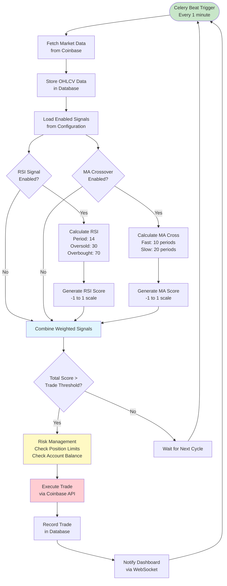
```mermaid
flowchart TD
    START([Celery Beat Trigger<br/>Every 1 minute]) --> FETCH[Fetch Market Data<br/>from Coinbase]
    
    FETCH --> STORE[Store OHLCV Data<br/>in Database]
    
    STORE --> LOAD[Load Enabled Signals<br/>from Configuration]
    
    LOAD --> RSI{RSI Signal<br/>Enabled?}
    LOAD --> MA{MA Crossover<br/>Enabled?}
    
    RSI -->|Yes| RSI_CALC[Calculate RSI<br/>Period: 14<br/>Oversold: 30<br/>Overbought: 70]
    RSI -->|No| COMBINE
    
    MA -->|Yes| MA_CALC[Calculate MA Cross<br/>Fast: 10 periods<br/>Slow: 20 periods]
    MA -->|No| COMBINE
    
    RSI_CALC --> RSI_SCORE[Generate RSI Score<br/>-1 to 1 scale]
    MA_CALC --> MA_SCORE[Generate MA Score<br/>-1 to 1 scale]
    
    RSI_SCORE --> COMBINE[Combine Weighted Signals]
    MA_SCORE --> COMBINE
    
    COMBINE --> THRESHOLD{Total Score ><br/>Trade Threshold?}
    
    THRESHOLD -->|Yes| RISK[Risk Management<br/>Check Position Limits<br/>Check Account Balance]
    THRESHOLD -->|No| WAIT[Wait for Next Cycle]
    
    RISK --> EXECUTE[Execute Trade<br/>via Coinbase API]
    
    EXECUTE --> RECORD[Record Trade<br/>in Database]
    RECORD --> NOTIFY[Notify Dashboard<br/>via WebSocket]
    
    WAIT --> START
    NOTIFY --> START
    
    style START fill:#c8e6c9
    style EXECUTE fill:#ffcdd2
    style RISK fill:#fff9c4
    style COMBINE fill:#e1f5fe
```

### Trading Decision Matrix
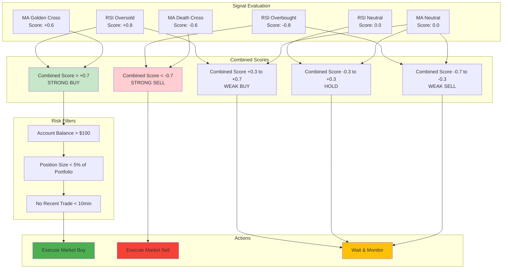
```mermaid
graph TD
    subgraph "Signal Evaluation"
        RSI_BUY[RSI Oversold<br/>Score: +0.8]
        RSI_SELL[RSI Overbought<br/>Score: -0.8]
        MA_BUY[MA Golden Cross<br/>Score: +0.6]
        MA_SELL[MA Death Cross<br/>Score: -0.6]
        RSI_NEUTRAL[RSI Neutral<br/>Score: 0.0]
        MA_NEUTRAL[MA Neutral<br/>Score: 0.0]
    end
    
    subgraph "Combined Scores"
        STRONG_BUY[Combined Score > +0.7<br/>STRONG BUY]
        WEAK_BUY[Combined Score +0.3 to +0.7<br/>WEAK BUY]
        HOLD[Combined Score -0.3 to +0.3<br/>HOLD]
        WEAK_SELL[Combined Score -0.7 to -0.3<br/>WEAK SELL]
        STRONG_SELL[Combined Score < -0.7<br/>STRONG SELL]
    end
    
    subgraph "Risk Filters"
        BALANCE[Account Balance > $100]
        POSITION[Position Size < 5% of Portfolio]
        COOLDOWN[No Recent Trade < 10min]
    end
    
    subgraph "Actions"
        BUY[Execute Market Buy]
        SELL[Execute Market Sell]
        WAIT[Wait & Monitor]
    end
    
    RSI_BUY --> STRONG_BUY
    MA_BUY --> STRONG_BUY
    RSI_BUY --> WEAK_BUY
    MA_NEUTRAL --> WEAK_BUY
    
    RSI_SELL --> STRONG_SELL
    MA_SELL --> STRONG_SELL
    RSI_SELL --> WEAK_SELL
    MA_NEUTRAL --> WEAK_SELL
    
    RSI_NEUTRAL --> HOLD
    MA_NEUTRAL --> HOLD
    
    STRONG_BUY --> BALANCE
    BALANCE --> POSITION
    POSITION --> COOLDOWN
    COOLDOWN --> BUY
    
    STRONG_SELL --> SELL
    WEAK_BUY --> WAIT
    HOLD --> WAIT
    WEAK_SELL --> WAIT
    
    style STRONG_BUY fill:#c8e6c9
    style STRONG_SELL fill:#ffcdd2
    style BUY fill:#4caf50
    style SELL fill:#f44336
    style WAIT fill:#ffc107
```

### Signal Configuration Flow
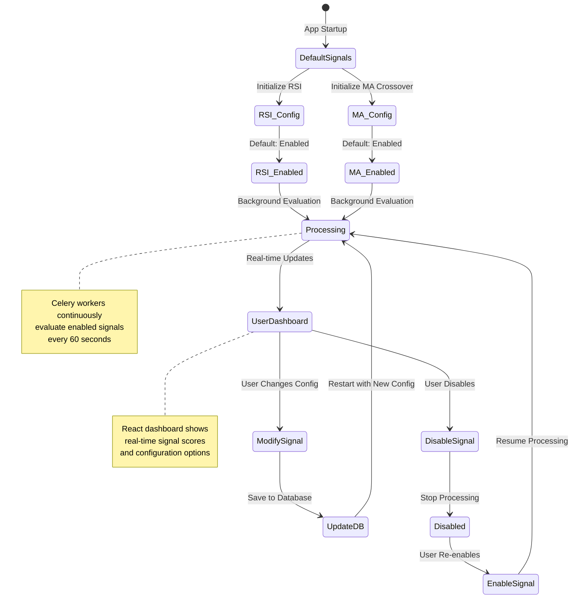
```mermaid
stateDiagram-v2
    [*] --> DefaultSignals: App Startup
    
    DefaultSignals --> RSI_Config: Initialize RSI
    DefaultSignals --> MA_Config: Initialize MA Crossover
    
    RSI_Config --> RSI_Enabled: Default: Enabled
    MA_Config --> MA_Enabled: Default: Enabled
    
    RSI_Enabled --> Processing: Background Evaluation
    MA_Enabled --> Processing: Background Evaluation
    
    Processing --> UserDashboard: Real-time Updates
    
    UserDashboard --> ModifySignal: User Changes Config
    ModifySignal --> UpdateDB: Save to Database
    UpdateDB --> Processing: Restart with New Config
    
    UserDashboard --> DisableSignal: User Disables
    DisableSignal --> Disabled: Stop Processing
    Disabled --> EnableSignal: User Re-enables
    EnableSignal --> Processing: Resume Processing
    
    note right of Processing
        Celery workers continuously
        evaluate enabled signals
        every 60 seconds
    end note
    
    note right of UserDashboard
        React dashboard shows
        real-time signal scores
        and configuration options
    end note
```

---

## 4. User Experience Journey

### Dashboard Navigation Flow
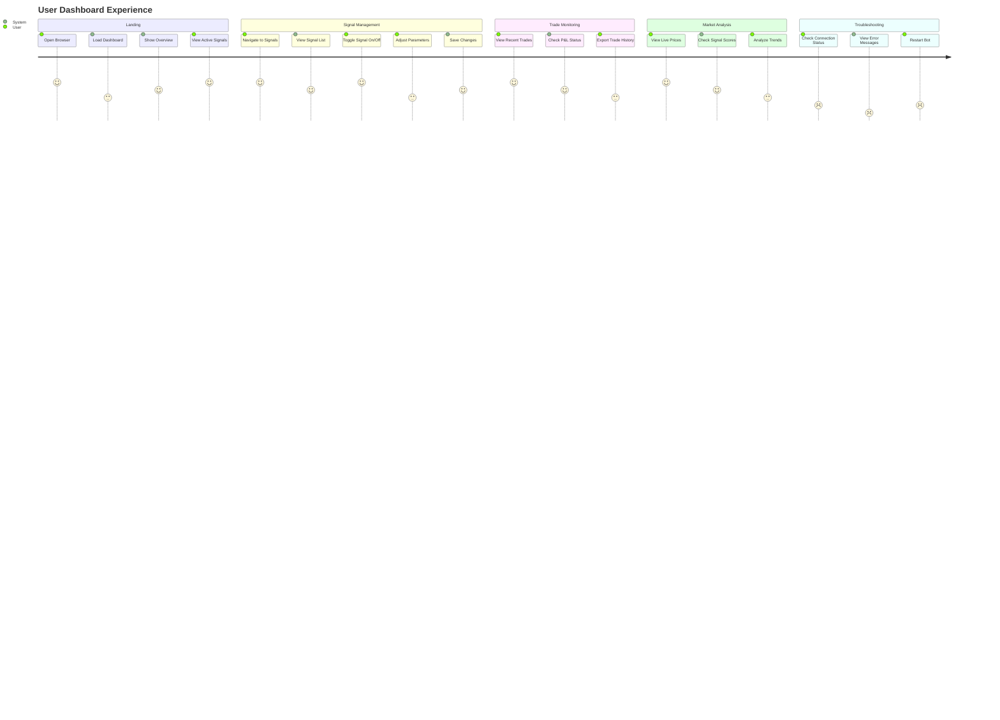
```mermaid
journey
    title User Dashboard Experience
    section Landing
      Open Browser: 5: User
      Load Dashboard: 3: System
      Show Overview: 4: System
      View Active Signals: 5: User
    section Signal Management
      Navigate to Signals: 5: User
      View Signal List: 4: System
      Toggle Signal On/Off: 5: User
      Adjust Parameters: 3: User
      Save Changes: 4: System
    section Trade Monitoring
      View Recent Trades: 5: User
      Check P&L Status: 4: System
      Export Trade History: 3: User
    section Market Analysis
      View Live Prices: 5: User
      Check Signal Scores: 4: System
      Analyze Trends: 3: User
    section Troubleshooting
      Check Connection Status: 2: User
      View Error Messages: 1: System
      Restart Bot: 2: User
```

### React Component Hierarchy
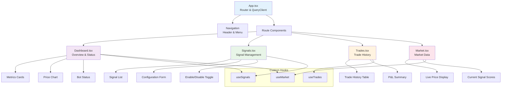
```mermaid
graph TD
    APP[App.tsx<br/>Router & QueryClient] --> NAV[Navigation<br/>Header & Menu]
    APP --> ROUTES[Route Components]
    
    ROUTES --> DASH[Dashboard.tsx<br/>Overview & Status]
    ROUTES --> SIG[Signals.tsx<br/>Signal Management]
    ROUTES --> TRADES[Trades.tsx<br/>Trade History]
    ROUTES --> MARKET[Market.tsx<br/>Market Data]
    
    DASH --> METRICS[Metrics Cards]
    DASH --> CHART[Price Chart]
    DASH --> STATUS[Bot Status]
    
    SIG --> SIG_LIST[Signal List]
    SIG --> SIG_CONFIG[Configuration Form]
    SIG --> SIG_TOGGLE[Enable/Disable Toggle]
    
    TRADES --> TRADE_TABLE[Trade History Table]
    TRADES --> PNL[P&L Summary]
    
    MARKET --> PRICE_DISPLAY[Live Price Display]
    MARKET --> SIGNAL_SCORES[Current Signal Scores]
    
    subgraph "Custom Hooks"
        USE_SIG[useSignals]
        USE_MARKET[useMarket]
        USE_TRADES[useTrades]
    end
    
    SIG --> USE_SIG
    MARKET --> USE_MARKET
    TRADES --> USE_TRADES
    DASH --> USE_SIG
    DASH --> USE_MARKET
    
    style APP fill:#e3f2fd
    style DASH fill:#f3e5f5
    style SIG fill:#e8f5e8
    style TRADES fill:#fff3e0
    style MARKET fill:#fce4ec
```

### User Interaction States
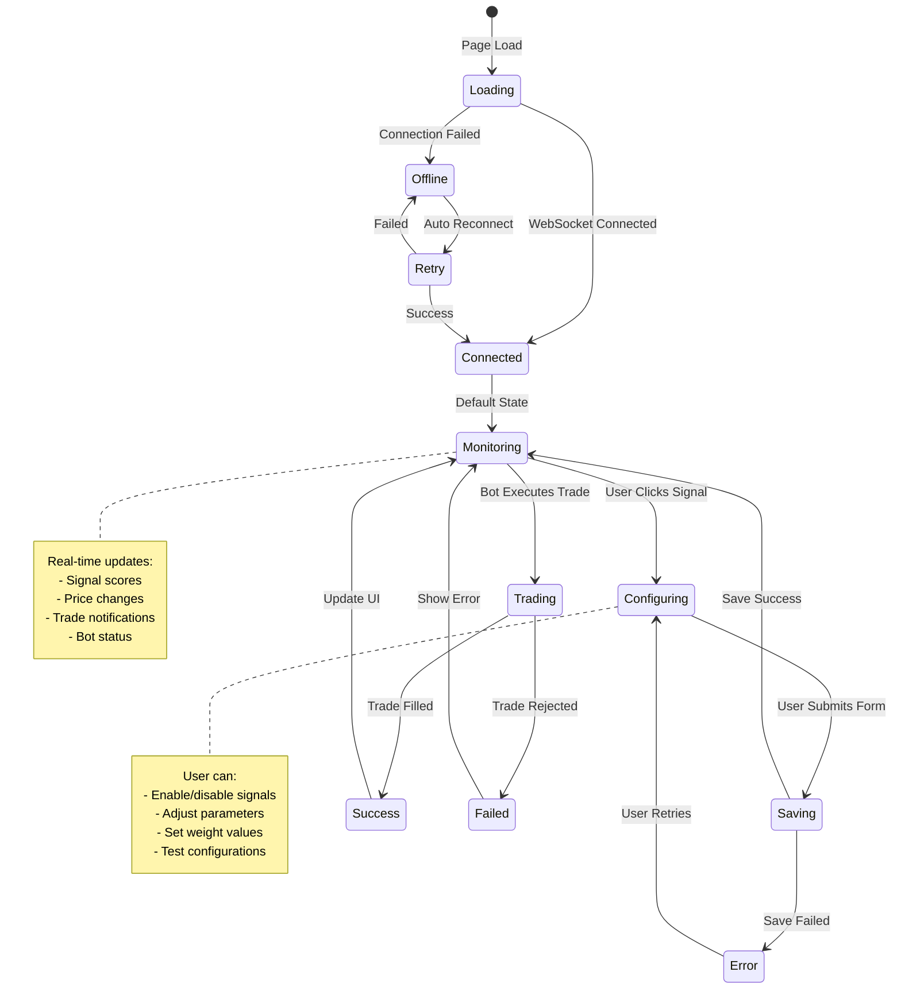
```mermaid
stateDiagram-v2
    [*] --> Loading: Page Load
    Loading --> Connected: WebSocket Connected
    Loading --> Offline: Connection Failed
    
    Connected --> Monitoring: Default State
    Offline --> Retry: Auto Reconnect
    Retry --> Connected: Success
    Retry --> Offline: Failed
    
    Monitoring --> Configuring: User Clicks Signal
    Configuring --> Saving: User Submits Form
    Saving --> Monitoring: Save Success
    Saving --> Error: Save Failed
    Error --> Configuring: User Retries
    
    Monitoring --> Trading: Bot Executes Trade
    Trading --> Success: Trade Filled
    Trading --> Failed: Trade Rejected
    Success --> Monitoring: Update UI
    Failed --> Monitoring: Show Error
    
    note right of Monitoring
        Real-time updates:
        - Signal scores
        - Price changes
        - Trade notifications
        - Bot status
    end note
    
    note right of Configuring
        User can:
        - Enable/disable signals
        - Adjust parameters
        - Set weight values
        - Test configurations
    end note
```

---

## 5. Bot Functionality Deep Dive

### Signal Processing Engine
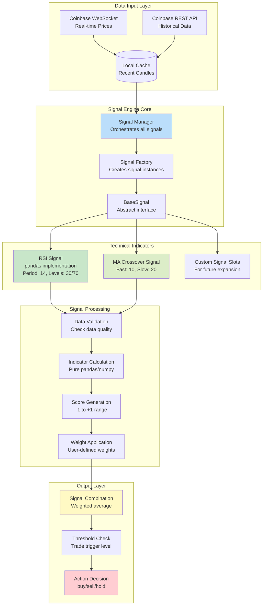
```mermaid
graph TB
    subgraph "Data Input Layer"
        COINBASE[Coinbase WebSocket<br/>Real-time Prices]
        REST[Coinbase REST API<br/>Historical Data]
        CACHE[(Local Cache<br/>Recent Candles)]
    end
    
    subgraph "Signal Engine Core"
        MANAGER[Signal Manager<br/>Orchestrates all signals]
        FACTORY[Signal Factory<br/>Creates signal instances]
        BASE[BaseSignal<br/>Abstract interface]
    end
    
    subgraph "Technical Indicators"
        RSI[RSI Signal<br/>pandas implementation<br/>Period: 14, Levels: 30/70]
        MA[MA Crossover Signal<br/>Fast: 10, Slow: 20]
        CUSTOM[Custom Signal Slots<br/>For future expansion]
    end
    
    subgraph "Signal Processing"
        VALIDATE[Data Validation<br/>Check data quality]
        CALCULATE[Indicator Calculation<br/>Pure pandas/numpy]
        SCORE[Score Generation<br/>-1 to +1 range]
        WEIGHT[Weight Application<br/>User-defined weights]
    end
    
    subgraph "Output Layer"
        COMBINE[Signal Combination<br/>Weighted average]
        THRESHOLD[Threshold Check<br/>Trade trigger level]
        ACTION[Action Decision<br/>buy/sell/hold]
    end
    
    COINBASE --> CACHE
    REST --> CACHE
    CACHE --> MANAGER
    
    MANAGER --> FACTORY
    FACTORY --> BASE
    BASE --> RSI
    BASE --> MA
    BASE --> CUSTOM
    
    RSI --> VALIDATE
    MA --> VALIDATE
    VALIDATE --> CALCULATE
    CALCULATE --> SCORE
    SCORE --> WEIGHT
    
    WEIGHT --> COMBINE
    COMBINE --> THRESHOLD
    THRESHOLD --> ACTION
    
    style MANAGER fill:#bbdefb
    style RSI fill:#c8e6c9
    style MA fill:#dcedc8
    style COMBINE fill:#fff9c4
    style ACTION fill:#ffcdd2
```

### Trading Execution Flow
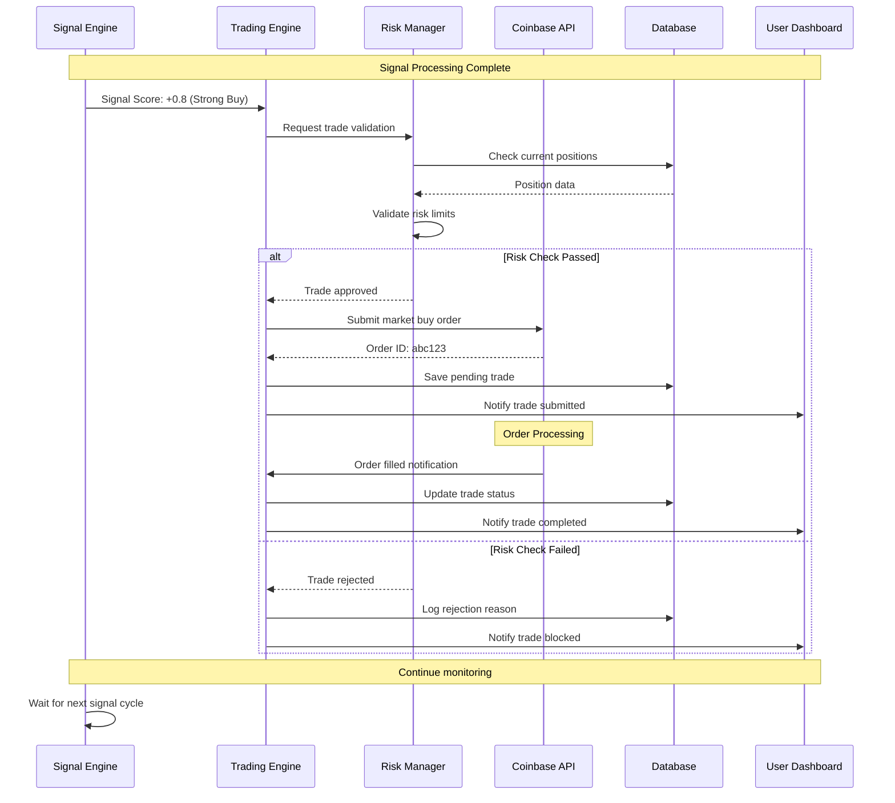
```mermaid
sequenceDiagram
    participant S as Signal Engine
    participant T as Trading Engine
    participant R as Risk Manager
    participant C as Coinbase API
    participant D as Database
    participant U as User Dashboard
    
    Note over S,U: Signal Processing Complete
    S->>T: Signal Score: +0.8 (Strong Buy)
    T->>R: Request trade validation
    R->>D: Check current positions
    D-->>R: Position data
    R->>R: Validate risk limits
    
    alt Risk Check Passed
        R-->>T: Trade approved
        T->>C: Submit market buy order
        C-->>T: Order ID: abc123
        T->>D: Save pending trade
        T->>U: Notify trade submitted
        
        Note over C: Order Processing
        C->>T: Order filled notification
        T->>D: Update trade status
        T->>U: Notify trade completed
    else Risk Check Failed
        R-->>T: Trade rejected
        T->>D: Log rejection reason
        T->>U: Notify trade blocked
    end
    
    Note over S,U: Continue monitoring
    S->>S: Wait for next signal cycle
```

### Risk Management System
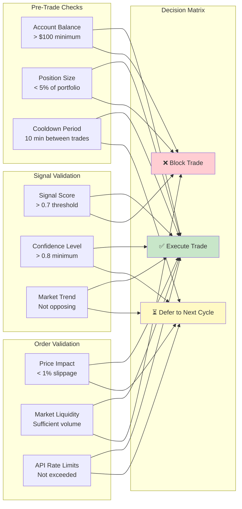
```mermaid
flowchart LR
    subgraph "Pre-Trade Checks"
        BAL[Account Balance<br/>> $100 minimum]
        SIZE[Position Size<br/>< 5% of portfolio]
        COOL[Cooldown Period<br/>10 min between trades]
    end
    
    subgraph "Signal Validation"
        SCORE[Signal Score<br/>> 0.7 threshold]
        CONF[Confidence Level<br/>> 0.8 minimum]
        TREND[Market Trend<br/>Not opposing]
    end
    
    subgraph "Order Validation"
        PRICE[Price Impact<br/>< 1% slippage]
        LIQ[Market Liquidity<br/>Sufficient volume]
        API[API Rate Limits<br/>Not exceeded]
    end
    
    subgraph "Decision Matrix"
        APPROVE[✅ Execute Trade]
        REJECT[❌ Block Trade]
        DEFER[⏳ Defer to Next Cycle]
    end
    
    BAL --> APPROVE
    SIZE --> APPROVE
    COOL --> APPROVE
    SCORE --> APPROVE
    CONF --> APPROVE
    TREND --> APPROVE
    PRICE --> APPROVE
    LIQ --> APPROVE
    API --> APPROVE
    
    BAL --> REJECT
    SIZE --> REJECT
    COOL --> DEFER
    SCORE --> REJECT
    CONF --> DEFER
    TREND --> DEFER
    PRICE --> DEFER
    LIQ --> REJECT
    API --> DEFER
    
    style APPROVE fill:#c8e6c9
    style REJECT fill:#ffcdd2
    style DEFER fill:#fff9c4
```

---

## 6. App Responsiveness Architecture

### Real-time Data Flow
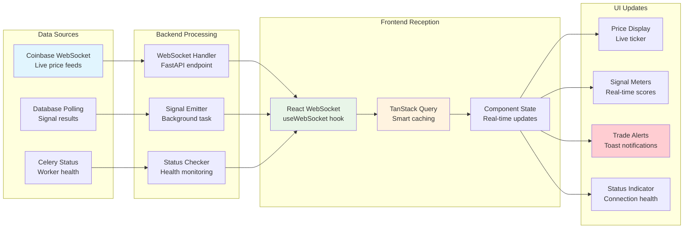
```mermaid
graph LR
    subgraph "Data Sources"
        WS[Coinbase WebSocket<br/>Live price feeds]
        DB_POLL[Database Polling<br/>Signal results]
        CELERY_STATUS[Celery Status<br/>Worker health]
    end
    
    subgraph "Backend Processing"
        WS_HANDLER[WebSocket Handler<br/>FastAPI endpoint]
        SIGNAL_EMITTER[Signal Emitter<br/>Background task]
        STATUS_CHECKER[Status Checker<br/>Health monitoring]
    end
    
    subgraph "Frontend Reception"
        REACT_WS[React WebSocket<br/>useWebSocket hook]
        QUERY_CACHE[TanStack Query<br/>Smart caching]
        STATE_MANAGER[Component State<br/>Real-time updates]
    end
    
    subgraph "UI Updates"
        PRICE_DISPLAY[Price Display<br/>Live ticker]
        SIGNAL_METERS[Signal Meters<br/>Real-time scores]
        TRADE_ALERTS[Trade Alerts<br/>Toast notifications]
        STATUS_INDICATOR[Status Indicator<br/>Connection health]
    end
    
    WS --> WS_HANDLER
    DB_POLL --> SIGNAL_EMITTER
    CELERY_STATUS --> STATUS_CHECKER
    
    WS_HANDLER --> REACT_WS
    SIGNAL_EMITTER --> REACT_WS
    STATUS_CHECKER --> REACT_WS
    
    REACT_WS --> QUERY_CACHE
    QUERY_CACHE --> STATE_MANAGER
    
    STATE_MANAGER --> PRICE_DISPLAY
    STATE_MANAGER --> SIGNAL_METERS
    STATE_MANAGER --> TRADE_ALERTS
    STATE_MANAGER --> STATUS_INDICATOR
    
    style WS fill:#e1f5fe
    style REACT_WS fill:#e8f5e8
    style QUERY_CACHE fill:#fff3e0
    style TRADE_ALERTS fill:#ffcdd2
```

### Performance Optimization Strategy
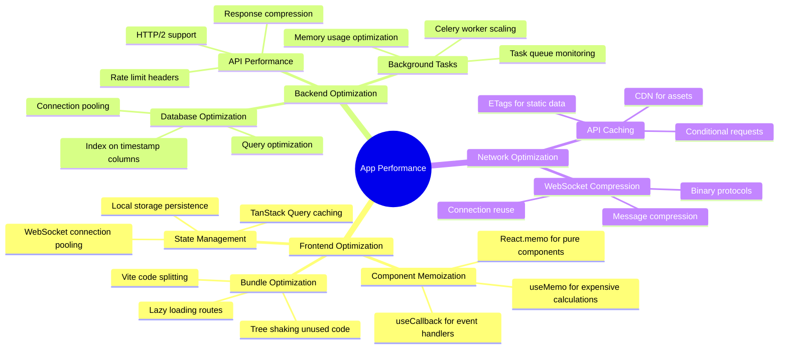
```mermaid
mindmap
  root((App Performance))
    Frontend Optimization
      Component Memoization
        React.memo for pure components
        useMemo for expensive calculations
        useCallback for event handlers
      Bundle Optimization
        Vite code splitting
        Lazy loading routes
        Tree shaking unused code
      State Management
        TanStack Query caching
        WebSocket connection pooling
        Local storage persistence
    Backend Optimization
      Database Optimization
        Connection pooling
        Query optimization
        Index on timestamp columns
      API Performance
        Response compression
        HTTP/2 support
        Rate limit headers
      Background Tasks
        Celery worker scaling
        Task queue monitoring
        Memory usage optimization
    Network Optimization
      WebSocket Compression
        Message compression
        Binary protocols
        Connection reuse
      API Caching
        ETags for static data
        Conditional requests
        CDN for assets
```

### Responsive Design Breakpoints
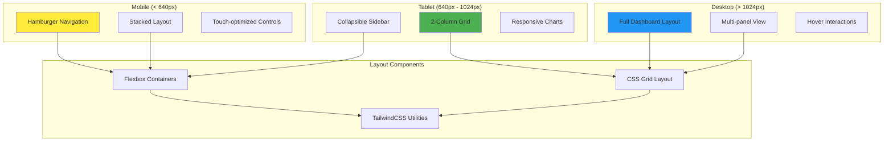
```mermaid
graph TD
    subgraph "Mobile (< 640px)"
        MOB_NAV[Hamburger Navigation]
        MOB_STACK[Stacked Layout]
        MOB_TOUCH[Touch-optimized Controls]
    end
    
    subgraph "Tablet (640px - 1024px)"
        TAB_GRID[2-Column Grid]
        TAB_SIDEBAR[Collapsible Sidebar]
        TAB_CHARTS[Responsive Charts]
    end
    
    subgraph "Desktop (> 1024px)"
        DESK_FULL[Full Dashboard Layout]
        DESK_MULTI[Multi-panel View]
        DESK_HOVER[Hover Interactions]
    end
    
    subgraph "Layout Components"
        FLEX[Flexbox Containers]
        GRID[CSS Grid Layout]
        TAIL[TailwindCSS Utilities]
    end
    
    MOB_NAV --> FLEX
    MOB_STACK --> FLEX
    TAB_GRID --> GRID
    TAB_SIDEBAR --> FLEX
    DESK_FULL --> GRID
    DESK_MULTI --> GRID
    
    FLEX --> TAIL
    GRID --> TAIL
    
    style MOB_NAV fill:#ffeb3b
    style TAB_GRID fill:#4caf50
    style DESK_FULL fill:#2196f3
```

---

## 7. Development Roadmap

### Implementation Phases
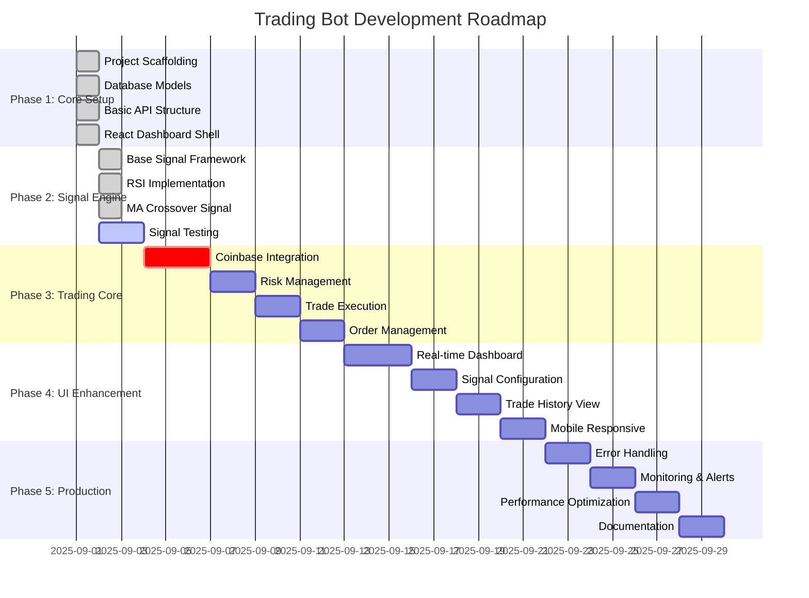
```mermaid
gantt
    title Trading Bot Development Roadmap
    dateFormat  YYYY-MM-DD
    section Phase 1: Core Setup
    Project Scaffolding     :done, setup, 2025-09-01, 1d
    Database Models        :done, models, 2025-09-01, 1d
    Basic API Structure    :done, api, 2025-09-01, 1d
    React Dashboard Shell  :done, react, 2025-09-01, 1d
    
    section Phase 2: Signal Engine
    Base Signal Framework  :done, signals, 2025-09-02, 1d
    RSI Implementation     :done, rsi, 2025-09-02, 1d
    MA Crossover Signal    :done, ma, 2025-09-02, 1d
    Signal Testing        :active, test_sig, 2025-09-02, 2d
    
    section Phase 3: Trading Core
    Coinbase Integration   :crit, coinbase, 2025-09-04, 3d
    Risk Management       :risk, 2025-09-07, 2d
    Trade Execution       :trade_exec, 2025-09-09, 2d
    Order Management      :orders, 2025-09-11, 2d
    
    section Phase 4: UI Enhancement
    Real-time Dashboard   :dashboard, 2025-09-13, 3d
    Signal Configuration  :config_ui, 2025-09-16, 2d
    Trade History View    :history, 2025-09-18, 2d
    Mobile Responsive     :mobile, 2025-09-20, 2d
    
    section Phase 5: Production
    Error Handling        :errors, 2025-09-22, 2d
    Monitoring & Alerts   :monitoring, 2025-09-24, 2d
    Performance Optimization :perf, 2025-09-26, 2d
    Documentation         :docs, 2025-09-28, 2d
```

### Feature Priority Matrix
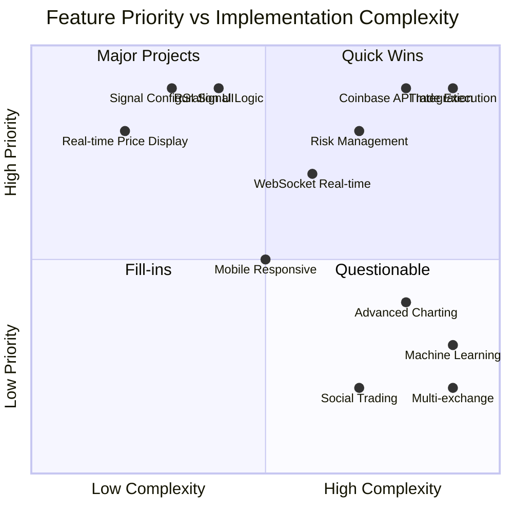
```mermaid
quadrantChart
    title Feature Priority vs Implementation Complexity
    x-axis Low Complexity --> High Complexity
    y-axis Low Priority --> High Priority
    
    quadrant-1 Quick Wins
    quadrant-2 Major Projects
    quadrant-3 Fill-ins
    quadrant-4 Questionable
    
    Signal Configuration UI: [0.3, 0.9]
    Real-time Price Display: [0.2, 0.8]
    RSI Signal Logic: [0.4, 0.9]
    Coinbase API Integration: [0.8, 0.9]
    Risk Management: [0.7, 0.8]
    Trade Execution: [0.9, 0.9]
    WebSocket Real-time: [0.6, 0.7]
    Mobile Responsive: [0.5, 0.5]
    Advanced Charting: [0.8, 0.4]
    Machine Learning: [0.9, 0.3]
    Multi-exchange: [0.9, 0.2]
    Social Trading: [0.7, 0.2]
```

### Technology Decision Tree
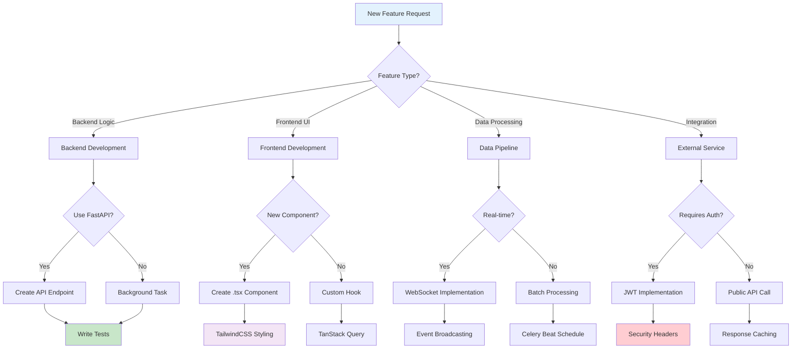
```mermaid
flowchart TD
    START[New Feature Request] --> TYPE{Feature Type?}
    
    TYPE -->|Backend Logic| BACKEND[Backend Development]
    TYPE -->|Frontend UI| FRONTEND[Frontend Development]
    TYPE -->|Data Processing| DATA[Data Pipeline]
    TYPE -->|Integration| EXTERNAL[External Service]
    
    BACKEND --> FASTAPI{Use FastAPI?}
    FASTAPI -->|Yes| ENDPOINT[Create API Endpoint]
    FASTAPI -->|No| CELERY[Background Task]
    
    FRONTEND --> REACT{New Component?}
    REACT -->|Yes| TSX[Create .tsx Component]
    REACT -->|No| HOOK[Custom Hook]
    
    DATA --> REALTIME{Real-time?}
    REALTIME -->|Yes| WEBSOCKET[WebSocket Implementation]
    REALTIME -->|No| BATCH[Batch Processing]
    
    EXTERNAL --> AUTH{Requires Auth?}
    AUTH -->|Yes| JWT[JWT Implementation]
    AUTH -->|No| PUBLIC[Public API Call]
    
    ENDPOINT --> TEST[Write Tests]
    CELERY --> TEST
    TSX --> STYLE[TailwindCSS Styling]
    HOOK --> QUERY[TanStack Query]
    WEBSOCKET --> BROADCAST[Event Broadcasting]
    BATCH --> SCHEDULE[Celery Beat Schedule]
    JWT --> SECURE[Security Headers]
    PUBLIC --> CACHE[Response Caching]
    
    style START fill:#e3f2fd
    style TEST fill:#c8e6c9
    style STYLE fill:#f3e5f5
    style SECURE fill:#ffcdd2
```

---

## Key Insights for Project Leadership

### Critical Success Factors
1. **Bot Functionality Priority**: Signal engine and trading logic are the core value drivers
2. **Real-time Responsiveness**: WebSocket connections and efficient state management ensure smooth UX
3. **Modular Architecture**: Each signal can be developed, tested, and deployed independently
4. **Risk Management**: Built-in safeguards prevent catastrophic losses
5. **Extensibility**: Easy to add new signals, exchanges, or features

### Development Focus Areas
1. **Immediate**: Complete Coinbase API integration and test with paper trading
2. **Short-term**: Implement comprehensive error handling and monitoring
3. **Medium-term**: Add more sophisticated signals and portfolio management
4. **Long-term**: Scale to multiple exchanges and advanced ML signals

### Technical Debt Prevention
1. **Testing Strategy**: Unit tests for signals, integration tests for API
2. **Documentation**: Keep visual diagrams updated as system evolves
3. **Code Quality**: Type safety with TypeScript, validation with Pydantic
4. **Performance Monitoring**: Track signal calculation times and API latency

This visual architecture guide provides the multi-perspective, multi-depth view needed to lead the project effectively while maintaining focus on bot functionality and app responsiveness.
