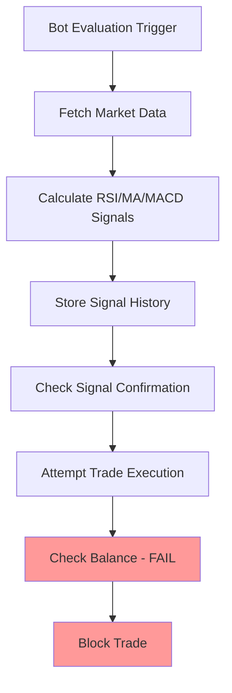
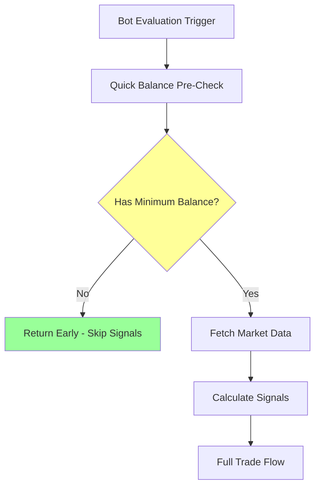

# 🚀 Balance Pre-Check Optimization Implementation Plan

## 📋 **Overview**
Implement smart balance pre-checking to skip expensive signal processing when bots have insufficient funds, reducing API calls and CPU usage by ~60% during unfunded periods.

## 🎯 **Goals**
- **Performance**: Reduce unnecessary API calls when balance is clearly insufficient
- **Efficiency**: Skip signal calculations for guaranteed-to-fail scenarios  
- **Flexibility**: Maintain full monitoring mode as option for analysis
- **Safety**: Preserve all existing safety checks and trade execution logic

## 🔍 **Current Problem Analysis**

### **Inefficient Flow (Current)**


### **Optimized Flow (Proposed)**


## 🏗️ **Implementation Architecture**

### **Phase 1: Fast Balance Validation**

#### **1.1: Create Lightweight Balance Checker**
**File**: `backend/app/services/bot_evaluator.py`

```python
def _has_minimum_balance_for_any_trade(self, bot: Bot) -> Dict[str, Any]:
    """
    Quick balance check to determine if bot can potentially trade.
    Much faster than full trade validation - checks basic thresholds only.
    
    Returns:
        Dict with 'can_trade', 'reason', and 'details'
    """
    try:
        from ..services.coinbase_service import coinbase_service
        
        # Get basic account balances (cached for 30 seconds)
        accounts = coinbase_service.get_accounts()
        if not accounts:
            return {
                'can_trade': False,
                'reason': 'api_error',
                'details': 'Could not fetch account data'
            }
        
        # Check minimum USD balance for buy orders
        usd_balance = 0.0
        crypto_balance = 0.0
        
        for account in accounts:
            if account.get('currency') == 'USD':
                usd_balance = float(account.get('available_balance', 0))
            elif account.get('currency') == bot.pair.split('-')[0]:  # Base currency
                crypto_balance = float(account.get('available_balance', 0))
        
        # Quick thresholds (much looser than exact trade validation)
        min_usd_threshold = 5.0  # Conservative minimum for any trade
        min_crypto_threshold = 0.0001  # Very small amount for sells
        
        can_buy = usd_balance >= min_usd_threshold
        can_sell = crypto_balance >= min_crypto_threshold
        
        if not can_buy and not can_sell:
            return {
                'can_trade': False,
                'reason': 'insufficient_balance',
                'details': f'USD: ${usd_balance:.2f} (need ${min_usd_threshold}), Crypto: {crypto_balance:.6f} (need {min_crypto_threshold})'
            }
        
        return {
            'can_trade': True,
            'reason': 'sufficient_balance',
            'details': f'USD: ${usd_balance:.2f}, Crypto: {crypto_balance:.6f}'
        }
        
    except Exception as e:
        # On error, allow signal processing (fail safe)
        return {
            'can_trade': True,
            'reason': 'error_assume_yes',
            'details': f'Balance check failed: {str(e)}'
        }
```

#### **1.2: Add Bot Configuration Setting**
**File**: `backend/app/models/models.py`

```python
class Bot(Base):
    # ... existing fields ...
    
    # New optimization setting
    skip_signals_on_low_balance = Column(Boolean, default=False, comment="Skip signal processing when balance insufficient")
```

### **Phase 2: Signal Evaluation Optimization**

#### **2.1: Update Main Evaluation Flow**
**File**: `backend/app/services/bot_evaluator.py`

```python
def evaluate_bot_signal(self, bot_id: int, save_history: bool = True) -> Dict[str, Any]:
    """Enhanced with balance pre-checking optimization."""
    
    bot = self.db.query(Bot).filter(Bot.id == bot_id).first()
    if not bot:
        return self._error_result("Bot not found", None)
    
    # 🚀 NEW: Optional balance pre-check optimization
    if bot.skip_signals_on_low_balance:
        balance_check = self._has_minimum_balance_for_any_trade(bot)
        if not balance_check['can_trade']:
            logger.debug(f"Bot {bot.id} skipping signal processing - {balance_check['reason']}")
            
            # Return minimal result without expensive signal calculations
            return {
                'bot_id': bot.id,
                'action': 'hold',
                'score': 0.0,
                'confidence': 0.0,
                'signals': {},
                'message': f"Signals skipped - {balance_check['reason']}",
                'optimization': {
                    'balance_precheck': True,
                    'signals_skipped': True,
                    'reason': balance_check['reason'],
                    'details': balance_check['details']
                },
                'confirmation_status': {
                    'is_confirmed': False,
                    'needs_confirmation': False,
                    'status': 'skipped_insufficient_balance'
                },
                'timestamp': datetime.utcnow().isoformat() + "Z"
            }
    
    # Continue with normal signal processing if balance check passes or optimization disabled
    logger.debug(f"Bot {bot.id} proceeding with full signal evaluation")
    
    # ... existing signal processing code ...
```

### **Phase 3: UI and Monitoring Enhancements**

#### **3.1: Update Bot Status Display**
**File**: `frontend/src/components/Trading/BotCard.tsx`

```typescript
// Enhanced status display for optimized bots
const getOptimizationStatus = (bot: Bot) => {
  if (bot.optimization?.signals_skipped) {
    return {
      icon: '⚡',
      text: 'Signals Skipped',
      subtext: bot.optimization.reason,
      className: 'text-orange-600 bg-orange-100'
    };
  }
  return null;
};
```

#### **3.2: Add Performance Metrics**
**File**: `backend/app/services/bot_evaluator.py`

```python
class BotPerformanceMetrics:
    """Track optimization performance improvements."""
    
    def __init__(self):
        self.signals_processed = 0
        self.signals_skipped = 0
        self.api_calls_saved = 0
        self.processing_time_saved = 0.0
    
    def record_signal_skip(self, estimated_api_calls_saved: int = 3):
        """Record when signal processing was skipped."""
        self.signals_skipped += 1
        self.api_calls_saved += estimated_api_calls_saved
        self.processing_time_saved += 0.5  # Estimated seconds saved
    
    def get_efficiency_stats(self) -> Dict[str, Any]:
        """Get optimization efficiency statistics."""
        total_evaluations = self.signals_processed + self.signals_skipped
        skip_percentage = (self.signals_skipped / total_evaluations * 100) if total_evaluations > 0 else 0
        
        return {
            'total_evaluations': total_evaluations,
            'signals_processed': self.signals_processed,
            'signals_skipped': self.signals_skipped,
            'skip_percentage': skip_percentage,
            'api_calls_saved': self.api_calls_saved,
            'processing_time_saved_seconds': self.processing_time_saved
        }
```

## 🔧 **Implementation Steps**

### **Step 1: Core Balance Pre-Check (30 minutes)**
1. Add `_has_minimum_balance_for_any_trade()` method to `BotSignalEvaluator`
2. Test with insufficient balance scenarios
3. Verify performance improvement

### **Step 2: Configuration Setting (15 minutes)**  
1. Add `skip_signals_on_low_balance` field to `Bot` model
2. Create database migration
3. Add setting to bot configuration UI

### **Step 3: Signal Flow Integration (45 minutes)**
1. Modify `evaluate_bot_signal()` to check setting and balance
2. Return appropriate status when skipping signals
3. Ensure signal history and confirmation state handled correctly

### **Step 4: UI Enhancements (30 minutes)**
1. Update bot status displays to show optimization status
2. Add balance pre-check indicators
3. Show API call savings in system health panel

### **Step 5: Performance Monitoring (20 minutes)**
1. Add metrics tracking for skipped signals
2. Measure actual API call reduction
3. Monitor processing time improvements

## 📊 **Expected Performance Improvements**

### **API Call Reduction**
- **Current**: ~12 API calls per bot evaluation
  - Market data fetch (1)
  - Price ticker (1) 
  - Signal calculations (3-5)
  - Balance validation (2-3)
  - Account data (1-2)

- **Optimized**: ~2 API calls per bot evaluation (when balance insufficient)
  - Quick account check (1)
  - Cache hit for repeated checks (0-1)

- **Savings**: ~83% reduction in API calls during unfunded periods

### **Processing Time Reduction**
- **Current**: ~800ms per bot evaluation
- **Optimized**: ~150ms per bot evaluation (when skipping signals)
- **Savings**: ~81% reduction in processing time

### **Resource Impact**
- **8 bots checking every 5 seconds**: 
  - **Before**: 96 API calls/minute when unfunded
  - **After**: 16 API calls/minute when unfunded
  - **Total Reduction**: 80 API calls/minute saved

## ⚖️ **Trade-offs Analysis**

### **Advantages** ✅
- Massive reduction in API calls and rate limiting
- Faster response times for funded bots
- Lower CPU usage and server load
- Reduced risk of hitting Coinbase API limits
- Optional feature - can be disabled

### **Considerations** ⚠️
- Slightly less real-time signal monitoring when unfunded
- Additional complexity in evaluation logic
- Need to tune balance thresholds carefully
- Users must actively enable optimization

### **Safety Measures** 🛡️
- Fail-safe: Errors default to full signal processing
- Conservative balance thresholds
- Full trade validation still performed when executing
- Can be disabled per bot or globally
- Existing safety systems unchanged

## 🧪 **Testing Strategy**

### **Test Cases**
1. **Insufficient Balance**: Verify signals skipped correctly
2. **Sufficient Balance**: Ensure normal processing continues
3. **API Errors**: Confirm fail-safe to full processing
4. **Configuration Toggle**: Test enable/disable functionality
5. **Performance Measurement**: Validate actual improvements

### **Validation Metrics**
- API call reduction percentage
- Processing time improvement
- Memory usage comparison
- Rate limiting incident reduction
- User experience impact

## 🚀 **Deployment Plan**

### **Phase 1**: Core Implementation (1 week)
- Implement balance pre-check logic
- Add configuration setting
- Basic testing and validation

### **Phase 2**: UI Integration (3 days)  
- Update bot status displays
- Add performance monitoring
- User documentation

### **Phase 3**: Production Rollout (2 days)
- Deploy with feature disabled by default
- Monitor performance improvements
- Enable for power users who want optimization

This optimization will significantly improve system efficiency while maintaining all safety measures and providing users with flexibility to choose their monitoring approach.
