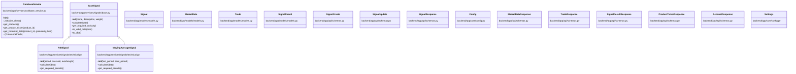

# Current Class Diagram

*Auto-generated from codebase - always current*

```mermaid
classDiagram
    class CoinbaseService {
        -__init__()
        -_initialize_client()
        +get_products()
        +get_product_ticker(product_id)
        +get_historical_data(product_id, granularity, limit)
        ... (2 more methods)
    }
    CoinbaseService : backend/app/services/coinbase_service.py
    class RSISignal {
        -__init__(period, oversold, overbought)
        +calculate(data)
        +get_required_periods()
    }
    RSISignal : backend/app/services/signals/technical.py
    class MovingAverageSignal {
        -__init__(fast_period, slow_period)
        +calculate(data)
        +get_required_periods()
    }
    MovingAverageSignal : backend/app/services/signals/technical.py
    class BaseSignal {
        -__init__(name, description, weight)
        +calculate(data)*
        +get_required_periods()*
        +is_valid_data(data)
        +to_dict()
    }
    BaseSignal : backend/app/services/signals/base.py
    class Signal {
    }
    Signal : backend/app/models/models.py
    class MarketData {
    }
    MarketData : backend/app/models/models.py
    class Trade {
    }
    Trade : backend/app/models/models.py
    class SignalResult {
    }
    SignalResult : backend/app/models/models.py
    class SignalCreate {
    }
    SignalCreate : backend/app/api/schemas.py
    class SignalUpdate {
    }
    SignalUpdate : backend/app/api/schemas.py
    class SignalResponse {
    }
    SignalResponse : backend/app/api/schemas.py
    class Config {
    }
    Config : backend/app/core/config.py
    class MarketDataResponse {
    }
    MarketDataResponse : backend/app/api/schemas.py
    class TradeResponse {
    }
    TradeResponse : backend/app/api/schemas.py
    class SignalResultResponse {
    }
    SignalResultResponse : backend/app/api/schemas.py
    class ProductTickerResponse {
    }
    ProductTickerResponse : backend/app/api/schemas.py
    class AccountResponse {
    }
    AccountResponse : backend/app/api/schemas.py
    class Settings {
    }
    Settings : backend/app/core/config.py
    BaseSignal <|-- RSISignal
    BaseSignal <|-- MovingAverageSignal
```
