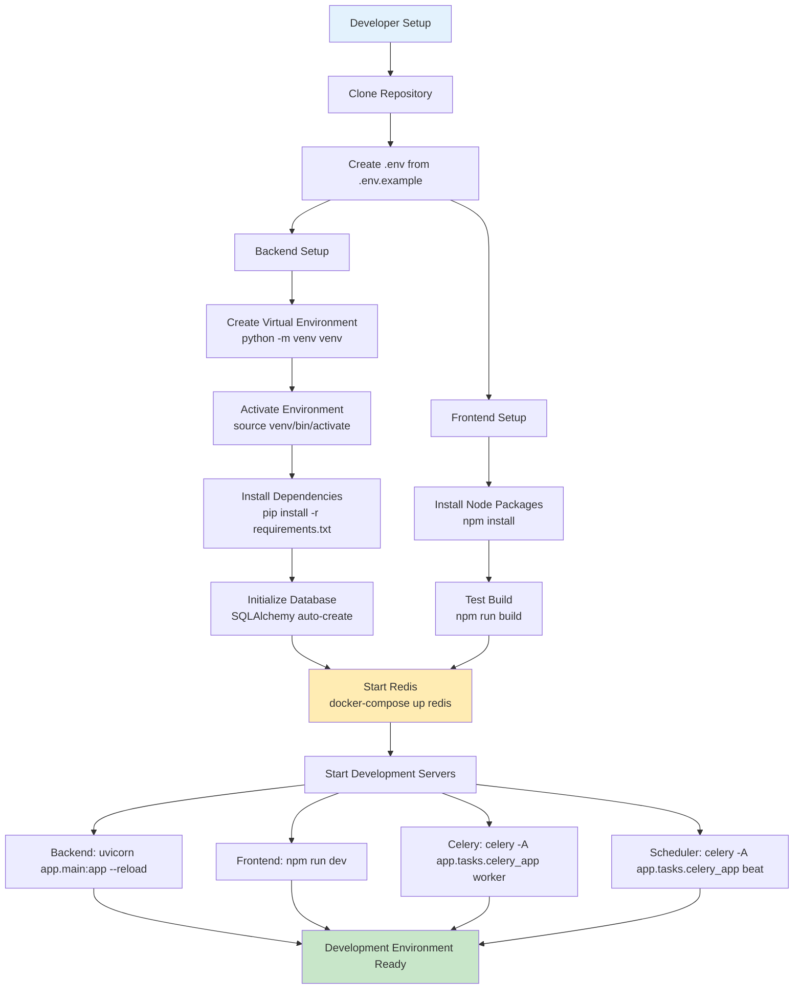
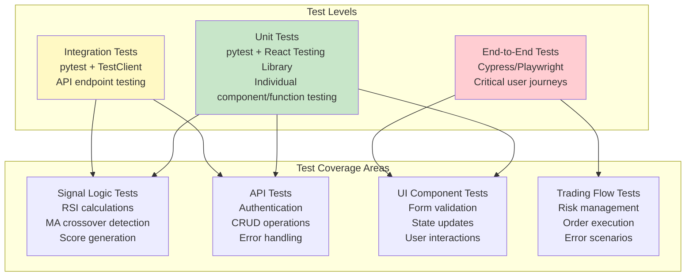
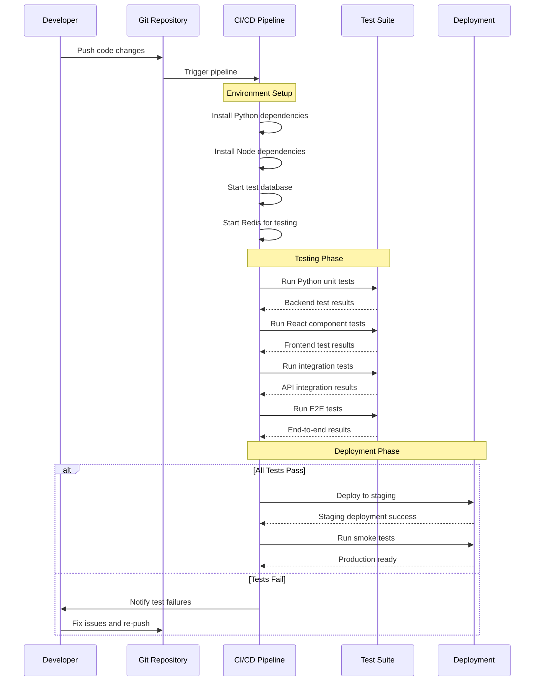
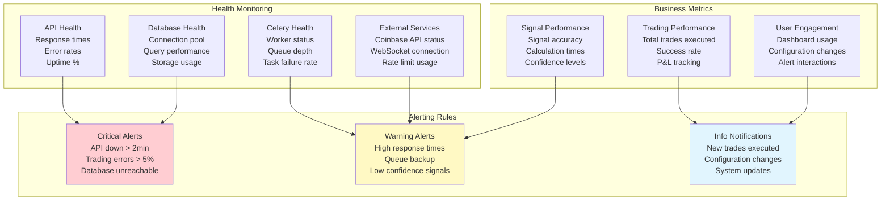
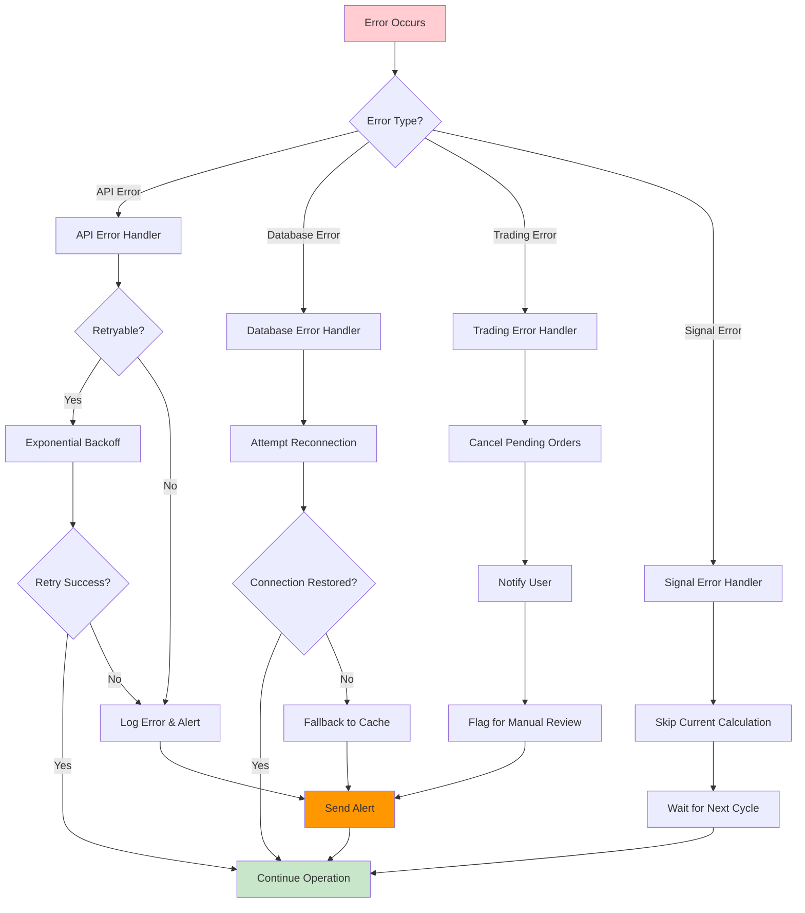
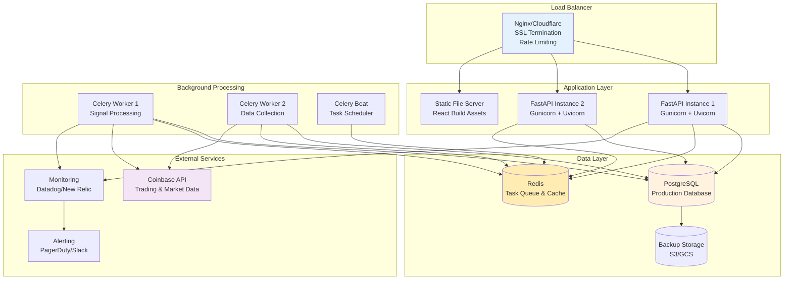
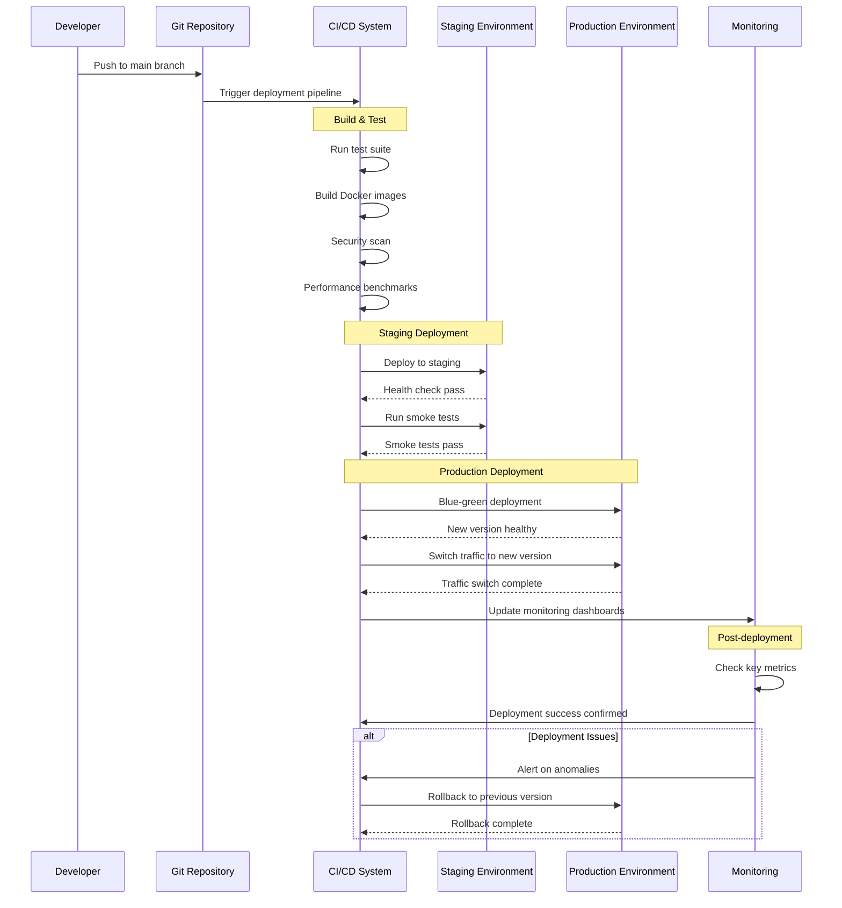
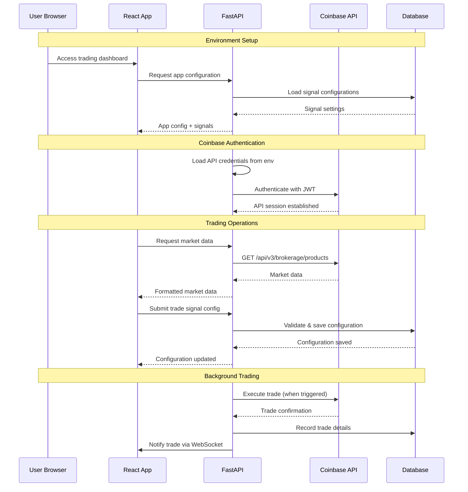
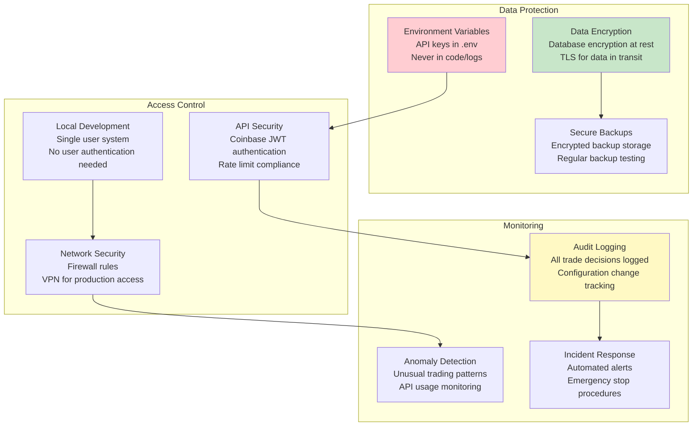

# Development Workflow Diagrams

This document contains additional visual diagrams for development workflows and operational procedures.

## Development Environment Setup

### Local Development Flow

## Testing Strategy

### Test Pyramid

### Continuous Integration Pipeline

## Monitoring and Observability

### System Health Dashboard

### Error Handling Flow

## Deployment Architecture

### Production Environment

### Deployment Pipeline

## Security Architecture

### Authentication & Authorization Flow

### Data Security Measures

This comprehensive set of diagrams provides the visual documentation needed to understand and lead the trading bot project from multiple perspectives, focusing on both bot functionality and app responsiveness as requested.
